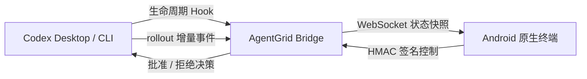

# AgentGrid

AgentGrid 把 Codex Desktop 与 Codex CLI 的实时运行态同步到旧 Android 手机。手机端是原生横屏应用，不依赖浏览器，以紧凑任务列表、彩色像素状态、状态音效和振动表达任务进度。

## 已实现

- Codex 开始、思考、工具执行、成功、失败、中断、等待批准、等待回答和离线状态。
- 每个任务使用 3×3 彩色像素核心；亮起的像素各自拥有独立三层 Bloom，位移、亮度和缩放连续变化。
- 活跃状态 60 FPS，空闲状态 30 FPS；终态过渡完成后停止持续动画。
- 任务行依次显示标题、用户输入、最新步骤或命令、来源、Token 总量、执行时间和状态。
- 点击任务行以内联动效展开输入、当前步骤和 Token 明细；展开内容限制最大高度并可独立滚动。
- 父任务创建子代理后会自动展开；子代理以内嵌列表显示名称、运行状态、耗时、最新一步和 Token 总量。
- 开始、成功、失败、等待批准、等待回答和中断的 8-bit 状态音。
- 多任务按注意力排序；等待批准、等待回答和失败任务会优先展开，其余任务降低亮度。
- 手机反向批准或拒绝仍然有效的 `PermissionRequest`。
- Codex 5 小时与周用量窗口。
- 二维码配对、Bonjour 广播、WebSocket 自动重连和心跳。
- HMAC-SHA256 控制签名、单调序号和重放保护。
- Mac 端只持久化短期运行态元数据；完成两小时后自动删除，最多保留 20 项。
- 手机端不保存任务记录；用户输入、最新步骤、子代理明细、问题和审批摘要只存在内存中。

## 控制能力边界

AgentGrid 只展示 Mac 端确认可执行的按钮。

| 操作 | 当前状态 | 说明 |
| --- | --- | --- |
| 批准 / 拒绝 | 可用 | 通过阻塞中的 Codex `PermissionRequest` Hook 返回真实决策 |
| 固定 / 静音 / 标为已读 | 可用 | AgentGrid 本地运行态控制 |
| 回答问题 | 仅提示 | rollout 能检测等待回答，但现有 Hook 不能稳定回写答案 |
| 中断 / 重试 | 暂不展示 | 任意现存 Codex Desktop/CLI 任务没有统一、可附着的稳定控制通道 |

协议已经为 `answer`、`interrupt` 和 `retry` 预留能力字段；未来接入可附着的 Codex app-server 通道后，手机端会按能力自动显示操作。

## 目录

- `macos/`：SwiftUI 菜单栏桥接应用、Codex Hook、本地 rollout 增量读取、状态和用量服务。
- `android/`：Kotlin + Jetpack Compose 原生横屏应用。
- `protocol/`：跨端协议、状态和签名约定。
- `scripts/`：打包、安装和本地端到端验证。
- `docs/`：第三方代码与字体归属。

## 环境

- macOS 14 或更高版本。
- Swift 6 / Xcode 26。
- Android Studio 自带 JDK、Android SDK 36。
- Android 10（API 29）或更高版本。
- Mac 与手机位于同一 Wi-Fi，路由器没有开启客户端隔离。

## 构建

一次构建两端：

```bash
./scripts/package-all.sh
```

产物位于：

```text
dist/AgentGrid Bridge.app
dist/AgentGrid-debug.apk
```

单独运行逻辑测试：

```bash
cd macos
swift test

cd ../android
JAVA_HOME="/Applications/Android Studio.app/Contents/jbr/Contents/Home" \
  ./gradlew testDebugUnitTest
```

项目只包含协议、状态归约、持久化、签名、重放保护和任务选择等逻辑测试，不包含 UI 自动化测试。

## 首次使用

1. 打开 `dist/AgentGrid Bridge.app`。
2. 点击菜单栏中的九宫格图标，选择“安装 Codex Hook”。安装会保留现有 Hook，并先生成时间戳备份。
3. 打开“AgentGrid 设置 → 连接”，显示配对二维码。
4. 在 Android 手机安装并打开 `dist/AgentGrid-debug.apk`，允许相机权限后扫描二维码。
5. 新启动一个 Codex 任务。手机会自动进入相应动画，并在需要批准时显示“允许 / 拒绝”。

已连接 Android 设备也可以直接安装：

```bash
./scripts/install-android.sh
```

华为设备若重启后没有自动进入终端，请在“应用启动管理”中允许 AgentGrid 自启动，并关闭针对 AgentGrid 的电池优化。

## 运行方式



Bridge 不在线时，Hook 会自动放行，不会阻塞 Codex。配对密钥保存在 macOS Keychain 和 Android Keystore；消息没有额外加密，建议只在可信局域网中使用。

## 本地端到端验证

先运行 Bridge，再执行：

```bash
./scripts/e2e-local.mjs
```

该脚本会验证 Hook → Bridge → WebSocket 状态同步，以及签名控制 → Bridge → Hook 批准返回链路。

## 许可

项目使用 GPL-3.0。部分必要实现参考并改写自作者自己的 Open Vibe Island，详见 `docs/OPEN_VIBE_ISLAND_ATTRIBUTION.md`；Silkscreen 字体使用 OFL-1.1。
