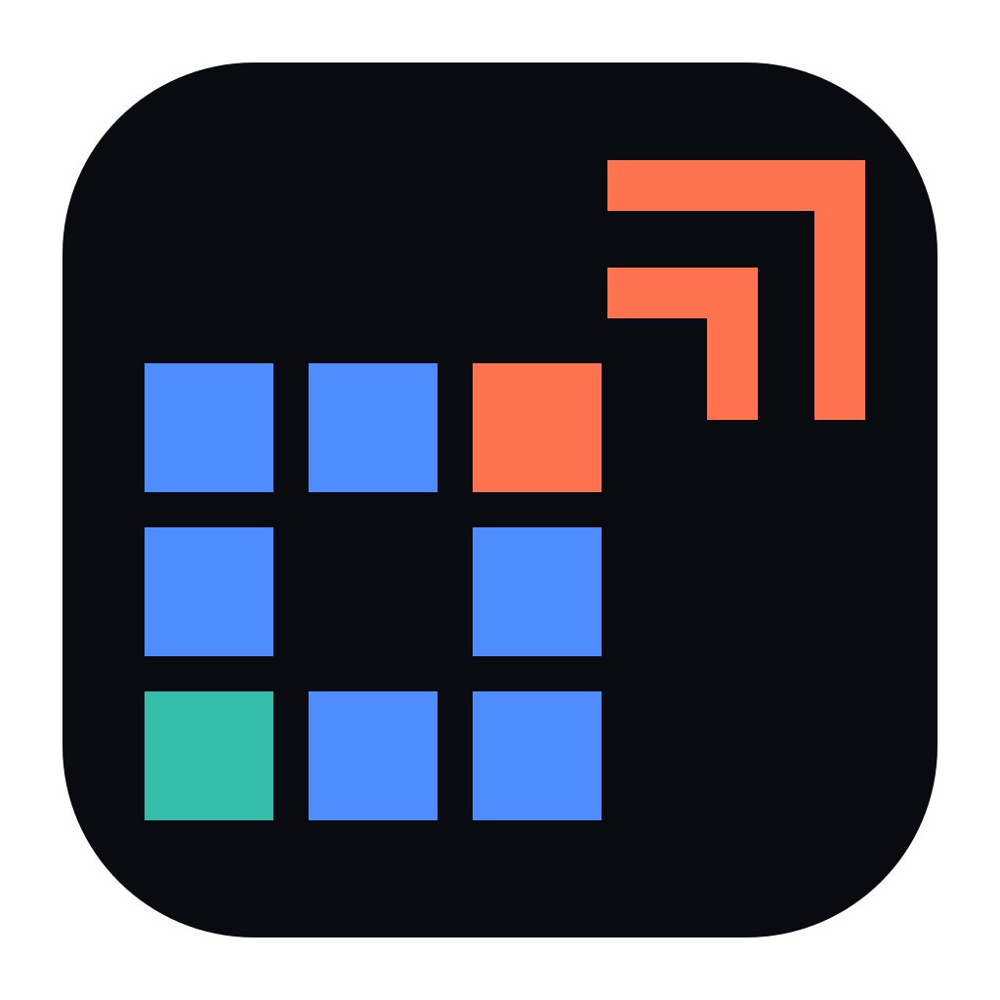
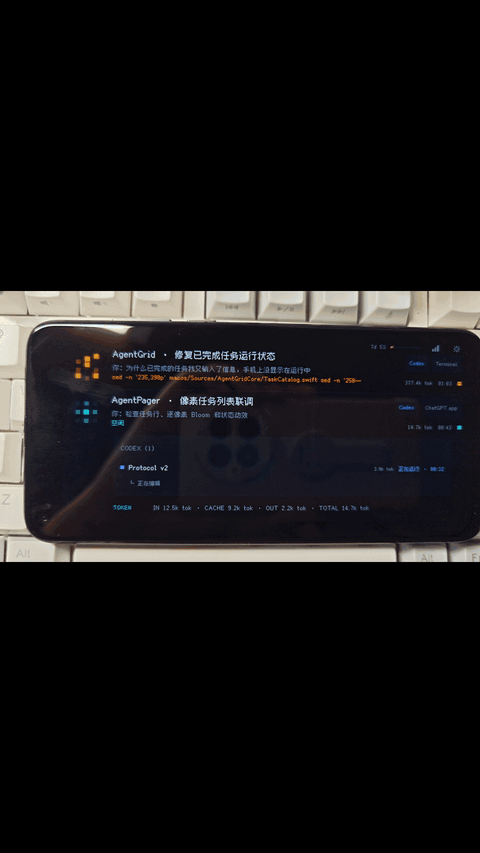

  

<a href="#english">English</a>

<h1 align="center">AgentPager</h1>

<strong>让闲置 Android 手机，成为 AI Agent 的专属状态终端。</strong>

  不必一直盯着 Mac，也不必再买一块开发板。 
  Codex 在做什么、是否完成、何时需要你批准，抬眼就能看到。

AgentPager 将 Codex Desktop 与 Codex CLI 的运行状态通过局域网实时同步到旧 Android 手机。把手机横放在桌面上，它就会变成一个常亮、安静，又能在关键时刻提醒你的 Agent 控制台。

## 查看效果

## 我为什么构建 AgentPager

我在社交媒体上看到有人用开发板做任务状态栏，于是也去研究了一下。查了一圈才发现，要满足我对屏幕显示、联网、声音、振动和触控操作的需求，还得搭配不同的硬件。

突然我意识到：这不跟手机差不多吗？这些能力它本来就有，屏幕更好、系统更完整，也不需要再买新的设备。

所以有了 AgentPager——让闲置手机重新上岗，成为一块真正好用的 AI Agent 状态终端。

## 为什么用 AgentPager

- **离开 Mac 也不会错过进度**：开始、思考、执行、完成、中断、等待批准、等待回答和离线状态一目了然。
- **多个任务也能快速找到重点**：需要你处理的任务自动置顶并展开，其他任务降低亮度，减少干扰。
- **重要时刻主动提醒**：像素动画、8-bit 音效和振动让完成、中断与等待操作不再悄无声息。
- **手机上直接批准或拒绝**：Codex 发起权限请求时，无需切回电脑即可处理。
- **子代理进度同屏可见**：父任务会展示正在工作的子代理、耗时、最新步骤与 Token 用量。
- **额度还剩多少随时可查**：集中查看 Codex 5 小时与周用量窗口，不必等到触顶才发现。
- **闲置旧手机重新派上用场**：原生横屏界面不依赖浏览器，摆在桌面上就是一块专注的 Agent 信息屏。

**最重要的是：它真的很好看(✧∀✧)！！！**

## 下载

前往 [GitHub Releases](../../releases/latest) 直接下载安装包：

- `AgentPager.apk`：安装到 Android 10 或更高版本的手机
- `AgentPager-macOS.dmg`：安装到 macOS 14 或更高版本的 Mac
- `AgentPager-Windows-Setup.exe`：安装到 Windows 10/11 x64

> 未经 Apple 公证的版本首次启动时，需要在 macOS“系统设置 → 隐私与安全性”中确认打开。
>
> Windows 安装包暂未签名。如果 SmartScreen 显示“Windows 已保护你的电脑”，请选择“更多信息 → 仍要运行”。首次启动时请在防火墙提示中只允许“专用网络”。
>
> Windows 安装包相对较大，是因为它采用自包含发布，将 .NET 8、WPF 和局域网服务所需的运行库一起打包，用户无需预先安装 .NET。经安装器压缩后约 60 MB。

## 快速开始

1. 从 Releases 下载 APK，以及对应电脑系统的 DMG 或 Windows 安装器。
2. 打开电脑上的 `AgentPager Bridge`。
3. 点击 macOS 菜单栏或 Windows 系统托盘中的图标，选择“安装 Codex Hook”。AgentPager 会保留原有 Hook 配置并自动备份。
4. 打开“AgentPager 设置 → 连接”，显示配对二维码。
5. 打开手机上的 AgentPager，扫描二维码。
6. 新建一个 Codex 任务，手机会自动显示它的实时状态。

Windows 首版支持原生 Codex（PowerShell 环境），暂不支持 Codex 运行在 WSL2 中。写入 Hook 后，需在 Codex 中运行 `/hooks` 并信任 AgentPager Hook。

## 当前可用的手机控制

| 操作 | 支持情况 |
| --- | --- |
| 批准 / 拒绝权限请求 | 可用 |
| 回答问题 | 可收到提醒，暂不能在手机上回复 |
| 中断 / 重试任务 | 暂不支持 |

## 隐私与安全

- 这是个纯本地软件，所有信息均在你的电脑你的手机上
- 建议仅在可信的局域网中使用。

**如果觉得本项目对你有用的话，欢迎 Star 鼓励一下 🌟**

## 贡献

欢迎贡献，现在仅支持 Codex，可以支持更多的 Agent。

## 许可

项目代码使用 GPL-3.0。第三方代码与字体归属见 [NOTICE.md](NOTICE.md)，字体许可全文位于 `LICENSES/`。

---

  

<h1 align="center">AgentPager</h1>

<strong>Turn an idle Android phone into a dedicated status terminal for your AI agents.</strong>

  No more staring at your Mac or buying another development board. 
  See what Codex is doing, when it finishes, and when it needs your approval at a glance.

AgentPager synchronizes the live status of Codex Desktop and Codex CLI to an old Android phone. Place the phone horizontally on your desk and it becomes an always-on, quiet agent console that gets your attention when it matters.

## See It in Action

## Why I Built AgentPager

I saw someone on social media build a task status display with a development board, so I looked into it too. It turned out that meeting my needs for a screen, networking, sound, vibration, and touch controls would require several pieces of hardware.

Then it clicked: isn't that basically a phone? It already has all of those capabilities, with a better screen, a more complete operating system, and no need to buy new hardware.

That is how AgentPager came to be: putting an idle phone back to work as a genuinely useful AI agent status terminal.

## Why AgentPager

- **Never miss progress when you are away from your Mac**: Starts, thinking, execution, completion, interruption, approval requests, answer requests, and offline status are all visible at a glance.
- **Find what matters across multiple tasks quickly**: Tasks that need your attention are automatically pinned and expanded, while others dim to reduce distraction.
- **Get proactive alerts at important moments**: Pixel animations, 8-bit sound effects, and vibration make completions, interruptions, and action requests hard to miss.
- **Approve or reject requests right from your phone**: Handle Codex permission requests without switching back to your computer.
- **See sub-agent progress on the same screen**: Parent tasks show active sub-agents, elapsed time, the latest step, and token usage.
- **Check your remaining quota anytime**: View Codex five-hour and weekly usage windows in one place instead of discovering the limit only after hitting it.
- **Give an old phone a new job**: The native landscape interface does not depend on a browser; leave it on your desk as a focused agent information display.

**Most importantly: it looks really good (✧∀✧)!!!**

## Download

Go to [GitHub Releases](../../releases/latest) to download the installers directly:

- `AgentPager.apk`: Install on an Android 10 or later phone.
- `AgentPager-macOS.dmg`: Install on a Mac running macOS 14 or later.
- `AgentPager-Windows-Setup.exe`: Install on a Windows 10/11 x64 PC.

> For the non-notarized build, confirm that you want to open it in macOS **System Settings > Privacy & Security** the first time you launch it.
>
> The Windows installer is currently unsigned. If SmartScreen appears, choose **More info > Run anyway**. On first launch, allow AgentPager only on **Private networks** in the Windows Firewall prompt.
>
> The Windows package is relatively large because it is self-contained and bundles .NET 8, WPF, and the runtime components required by the LAN service, so users do not need to install .NET separately. The published single executable is about 200 MB and compresses to roughly 60 MB in the installer.

## Quick Start

1. Download the APK and the DMG or Windows installer for your computer.
2. Open `AgentPager Bridge` on your computer.
3. Click the icon in the macOS menu bar or Windows system tray and choose **Install Codex Hook**. AgentPager keeps your existing Hook configuration and automatically creates a backup.
4. Open **AgentPager Settings > Connection** to display the pairing QR code.
5. Open AgentPager on your phone and scan the QR code.
6. Create a Codex task. Its live status will automatically appear on your phone.

The first Windows release supports native Codex running with PowerShell; Codex running inside WSL2 is not yet supported. After installing the Hook, run `/hooks` in Codex and trust the AgentPager definition.

## Currently Available Phone Controls

| Action | Support |
| --- | --- |
| Approve / reject permission requests | Available |
| Answer questions | Notifications are available; replying from the phone is not yet supported |
| Interrupt / retry tasks | Not yet supported |

## Privacy and Security

- This is fully local software: all information stays on your computer and phone.
- Use it only on a trusted local network.

**If you find this project useful, a Star would mean a lot.**

## Contributing

Contributions are welcome. Codex is currently the only supported agent, and support for more agents can be added.

## License

The project code is licensed under GPL-3.0. See [NOTICE.md](NOTICE.md) for third-party code and font attributions; full font license texts are in `LICENSES/`.
